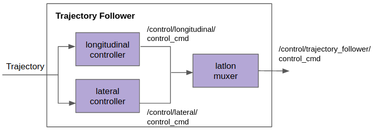

Trajectory Follower {#trajectory-follower}
=============================================

# Purpose

Generate control commands to follow a given Trajectory.

# Design

This functionality is decomposed into three nodes.
- `LateralController`: generates lateral control messages.
- `LongitudinalController`: generates longitudinal control messages.
- [`LatLonMuxer`](latlon_muxer-design.md): combines the lateral and longitudinal control commands
into a single control command.

