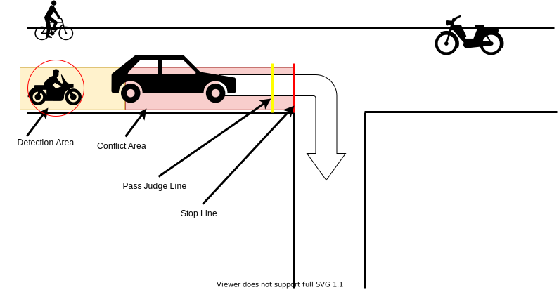

# The `behavior_velocity_planner` Package

## Overview

`behavior_velocity_planner` is a planner that adjust velocity based on the traffic rules. It
consists of several modules.

- Blind Spot
- Crosswalk
- Detection Area
- Intersection
- Stop Line

When each module plans velocity, it considers based on `base_link`(center of rear-wheel axis) pose.
So for example, in order to stop at a stop line with the vehicles' front on the stop line, it
calculates `base_link` position from the distance between `base_link` to front and modifies path
velocity from the `base_link` position.

## Input topics

| Name                                   | Type                                                    | Description                               |
|----------------------------------------|---------------------------------------------------------|-------------------------------------------|
| `HAD_Map_Client`                       | autoware_auto_mapping_msgs::srv::HADMapService          | HAD Map information                       |
| `~/input/path_with_lane_id`            | autoware_auto_planning_msgs::msg::PathWithLaneId        | Path with lane_id                         |
| `~/input/dynamic_objects`              | autoware_auto_perception_msgs::msg::PredictedObjects    | Dynamic objects from perception module    |
| `~/input/vehicle_velocity`             | autoware_auto_vehicle_msgs::msg::VehicleKinematicState  | For ego-velocity                          |
| `~/input/no_ground_pointcloud`         | sensor_msgs::msg::PointCloud2                           | Obstacle pointcloud                       |
| `~/input/external_crosswalk_states`    | autoware_auto_planning_msgs::msg::OrderMovement         | Movement order to follow in crosswalks    |
| `~/input/external_intersection_states` | autoware_auto_planning_msgs::msg::OrderMovement         | Movement order to follow in intersections |

## Output topics

| Name                    | Type                                         | Description                            |
|-------------------------|----------------------------------------------|----------------------------------------|
| `~/output/trajectory`   | autoware_auto_planning_msgs::msg::Trajectory | Trajectory for controller to follow    |
| `~/output/stop_reasons` | diagnostic_msgs::msg::DiagnosticStatus       | Reasons that cause the vehicle to stop |
| `~/debug/path`          | visualization_msgs::msg::MarkerArray         | Path markers for rviz2 to debug        |

## Node parameters

| Parameter               | Type   | Description                                                                         |
| ----------------------- | ------ | ----------------------------------------------------------------------------------- |
| `launch_blind_spot`     | bool   | whether to launch blind_spot module                                                 |
| `launch_crosswalk`      | bool   | whether to launch crosswalk module                                                  |
| `launch_detection_area` | bool   | whether to launch detection_area module                                             |
| `launch_intersection`   | bool   | whether to launch intersection module                                               |
| `launch_traffic_light`  | bool   | whether to launch traffic light module                                              |
| `launch_stop_line`      | bool   | whether to launch stop_line module                                                  |
| `forward_path_length`   | double | forward path length                                                                 |
| `backward_path_length`  | double | backward path length                                                                |
| `max_accel`             | double | (to be a global parameter) max acceleration of the vehicle                          |
| `delay_response_time`   | double | (to be a global parameter) delay time of the vehicle's response to control commands |

## Modules

### Stop Line

#### Role

This module plans velocity so that the vehicle can stop right before stop lines and restart driving
after stopped.

#### Module Parameters

| Parameter         | Type   | Description                                                                                    |
| ----------------- | ------ | ---------------------------------------------------------------------------------------------- |
| `stop_margin`     | double | a margin that the vehicle tries to stop before stop_line                                       |
| `stop_check_dist` | double | when the vehicle is within `stop_check_dist` from stop_line and stopped, move to STOPPED state |

#### Flowchart

```plantuml
@startuml
title modifyPathVelocity
start

:find collision between path and stop_line;

if (collision is found?) then (yes)
else (no)
  stop
endif

:find offset segment;

:calculate stop pose;

:calculate distance to stop line;

if (state is APPROACH) then (yes)
  :set stop velocity;

  if (vehicle is within stop_check_dist?) then (yes)
    if (vehicle is stopped?) then (yes)
      :change state to STOPPED;
    endif
  endif
else if (state is STOPPED) then (yes)
  if (vehicle started to move?) then (yes)
    :change state to START;
  endif
else if (state is START) then (yes)
  if ([optional] far from stop line?) then (yes)
    :change state to APPROACH;
  endif
endif

stop
@enduml
```

This algorithm is based on `segment`.
`segment` consists of two node points. It's useful for removing boundary conditions because
if `segment(i)` exists we can assume `node(i)` and `node(i+1)` exist.

First, this algorithm finds a collision between reference path and stop line. Then, we can
get `collision segment` and `collision point`.

Next, based on `collision point`, it finds `offset segment` by iterating backward points up to a
specific offset length. The offset length is `stop_margin`(parameter) + `base_link to front`(to
adjust head pose to stop line). Then, we can get `offset segment` and `offset from segment start`.

After that, we can calculate a offset point from `offset segment` and `offset`. This will
be `stop_pose`.

### Intersection

#### Role

Judgement whether a vehicle can go into an intersection or not by a dynamic object information, and
planning a velocity of the start/stop

#### Launch Timing

Launches when there is an intersection area on a target lane

#### Module Parameters

| Parameter                                     | Type   | Description                                                                   |
| --------------------------------------------- | ------ | ----------------------------------------------------------------------------- |
| `intersection/state_transit_margin_time`      | double | [s] time margin to change state                                               |
| `intersection/decel_velocity`                 | double | [m/s] deceleration velocity in intersection                                   |
| `intersection/path_expand_width`              | double | [m] path area to see with expansion                                           | 
| `intersection/stop_line_margin`               | double | [m] margin before stop line                                                   |
| `intersection/stuck_vehicle_detect_dist`      | double | [m] this should be the length between cars when they are stopped.             |
| `intersection/stuck_vehicle_ignore_dist`      | double | [m] obstacle stop max distance(5.0m) + stuck vehicle size / 2 (0.0m-)         |
| `intersection/stuck_vehicle_vel_thr`          | double | [m/s] velocity below 3[km/h] is ignored by default                            |
| `intersection/intersection_velocity`          | double | [m/s] velocity to pass intersection. 10[km/h] is by default                   |
| `intersection/intersection_max_accel`         | double | [m/s^2] acceleration in intersection                                          |
| `intersection/detection_area_length`          | double | [m] range for lidar detection 200m is by default                              |

#### Flowchart

```plantuml
@startuml
title modifyPathVelocity
start

:get object polygon;

partition get_objective_polygon {

:get "right-of-way" lanelets from ego lanelet;

:get previous and following ego lanelet from routing graph;

:get all conflicting lanelets with ego lane;

:exclude yield and ego lanelets from conflicting lanelets;

:update conflicting and objective polygon;
}

:get external Input;

:generate stop line;

if (not generate stop line) then (yes)
  stop
else (no)
endif

if (stop line index or pass judge index is same lane as ego?) then (yes)
  stop
else (no)
endif

if (not found closest index?) then (yes)
  stop
else (no)
endif

if (state is GO and over pass judge line and no external stop) then (yes)
  stop
else (no)
endif

if (has collision or is stuck vehicle in intersection?) then (yes)
  :set is_entry_prohibited true;
  :set state from external input;
else (no)
endif

:set state with margin time;

if (current state is same as previous state) then (yes)
  :reset timer;
else if (state is GO->STOP) then (yes)
  :set state as STOP;
  :reset timer;
else if (state is STOP -> GO) then (yes)
  if (start time is not set) then (yes)
    :set start time;
  else(no)
   :calculate duration;
   if(duration is more than margin time)then (yes)
    :set state GO;
    :reset timer;
   endif
  endif
endif

if (state is STOP?) then (yes)
  :set velocity;
  if (stop required?) then (yes)
    :publish stop reason and stop factor;
  endif
else(no)
endif
stop

@enduml
```

NOTE current state is treated as `STOP` if `is_entry_prohibited` = `true` else `GO`

### CrossWalk

#### Role

Judgement whether a vehicle can go into a crosswalk and plan a velocity of the start/stop.

#### Launch Timing

Launches when there is a crosswalk on the target lane.

#### Module Parameters

| Parameter                                              | Type   | Description                                                              |
| ------------------------------------------------------ | ------ | ------------------------------------------------------------------------ |
| `crosswalk/stop_line_distance`                         | double | [m] make stop line away from crosswalk when no explicit stop line exists |
| `crosswalk/stop_margin`                                | double | [m] a margin that the vehicle tries to stop before stop_line             |
| `crosswalk/slow_margin`                                | bool   | [m] a margin that the vehicle tries to slow down before stop_line        |
| `crosswalk/slow_velocity`                              | double | [m/s] a slow down velocity                                               |
| `crosswalk/stop_dynamic_object_prediction_time_margin` | double | [s] time margin for decision of ego vehicle to stop or not               |
| `walkway/stop_line_distance`                           | double | [m] make stop line away from crosswalk when no explicit stop line exists |
| `walkway/stop_margin`                                  | double | [m] a margin that the vehicle tries to stop before walkway               |

#### Flowchart

flow chart is almost the same as stop line.

### Detection Area

#### Role

If pointcloud is detected in a detection area defined on a map, the stop planning will be executed
at the predetermined point.

#### Launch Timing

Launches if there is a detection area on the target lane.

### Algorithm

1. Gets a detection area and stop line from map information and confirms if there is pointcloud in
   the detection area
2. Inserts stop point l[m] in front of the stop line
3. Inserts a pass judge point to a point where the vehicle can stop with a max deceleration
4. Sets velocity as zero behind the stop line when the ego-vehicle is in front of the pass judge
   point
5. If the ego vehicle has passed the pass judge point already, it doesn’t stop and pass through.

#### Module Parameters

| Parameter             | Type   | Description                                                                                        |
| --------------------- | ------ | -------------------------------------------------------------------------------------------------- |
| `stop_margin`         | double | [m] a margin that the vehicle tries to stop before stop_line                                       |
| `use_dead_line`       | bool   | [-] weather to use dead line or not                                                                |
| `dead_line_margin`    | double | [m] ignore threshold that vehicle behind is collide with ego vehicle or not                        |
| `use_pass_judge_line` | bool   | [-] weather to use pass judge line or not                                                          |
| `state_clear_time`    | double | [s] when the vehicle is stopping for certain time without incoming obstacle, move to STOPPED state |

#### Flowchart

```plantuml
@startuml
title modifyPathVelocity
start

:get obstacle point cloud in detection area;

if (no obstacle point cloud in detection area?) then (yes)
else (no)
  :set last time obstacle found;
endif

:get clear stop state duration;

if (clear stop state duration is more than state_clear_time?) then (yes)
  :set current state GO;
  :reset clear stop state duration;
  stop
else (no)
endif

if (use dead line?) then (yes)
  :create dead line point;
  if (Is there dead line point?) then (yes)
    if (Is over dead line point?) then (yes)
      stop
    endif
  endif
endif

:calculate stop point;

if (stop point?) then (yes)
else (no)
  stop
endif


if (state is not stop and ego vehicle over line?) then (yes)
  stop
endif

if (use pass judge line?) then (yes)
  if (state is not STOP and not enough braking distance?) then (yes)
    stop
  endif
endif

:set state STOP;

:inset stop point;

:append stop reason and stop factor;

stop
@enduml
```

### Blind Spot

#### Role

Blind spot check while turning right/left by a dynamic object information, and planning and planning
of a velocity of the start/stop.

### Definition

Sets a stop line, a pass judge line, a detection area and conflict area based on a map information
and a self position.

- Stop line : Automatically created based on crossing lane information.

- Pass judge line : A position to judge if stop or not to avoid a rapid brake.

- Detection area : Right/left side area of the self position.

- Conflict area : Right/left side area from the self position to the stop line.

#### Module Parameters

| Parameter                       | Type   | Description                                                                 |
| ------------------------------- | ------ | --------------------------------------------------------------------------- |
| `stop_line_margin`              | double | [m] a margin that the vehicle tries to stop before stop_line                |
| `backward_length`               | double | [m] distance from closest path point to the edge of beginning point.        |
| `ignore_width_from_center_line` | double | [m] ignore threshold that vehicle behind is collide with ego vehicle or not |
| `max_future_movement_time`      | double | [s] maximum time for considering future movement of object                  |

#### Flowchart

```plantuml
@startuml
title modifyPathVelocity
start

if (ego is turning right or left ?) then (yes)
else (no)
  stop
endif

:calculate pass judge Line;

if (ego vehicle is not after pass judge line?) then (yes)
else (no)
  stop
endif

:check obstacle in blind spot;

if (obstacle found in blind spot?) then (yes)
  :set current state as STOP;
else (no)
  :set current state as GO;
endif

:set state with margin time;

if (current state is same as previous state) then (yes)
  :reset timer;
else if (state is GO->STOP) then (yes)
  :set state as STOP;
  :reset timer;
else if (state is STOP -> GO) then (yes)
  if (start time is not set) then (yes)
    :set start time;
  else(no)
   :calculate duration;
   if(duration is more than margin time)then (yes)
    :set state GO;
    :reset timer;
   endif
  endif
endif


if (state is STOP) then (yes)
  :set stop velocity;

  :set stop reason and factor;
endif

stop
@enduml
```