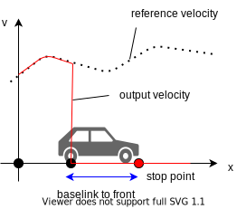

# The `behavior_velocity_planner` Package

## Overview

`behavior_velocity_planner` is a planner that adjust velocity based on the traffic rules.
It consists of several modules.

- Blind Spot
- Crosswalk
- Detection Area
- Intersection
- Stop Line

When each module plans velocity, it considers based on `base_link`(center of rear-wheel axis) pose.
So for example, in order to stop at a stop line with the vehicles' front on the stop line, it calculates `base_link` position from the distance between `base_link` to front and modifies path velocity from the `base_link` position.

## Input topics

| Name                                      | Type                                              | Description                               |
| ----------------------------------------  | ------------------------------------------------  | ----------------------------------------- |
| `~/input/path_with_lane_id`               | autoware_auto_msgs::msg::PathWithLaneId           | path with lane_id                         |
| `~/input/vector_map`                      | autoware_auto_msgs::msg::HADMapBin                | vector map                                |
| `~/input/vehicle_velocity`                | geometry_msgs::msg::TwistStamped                  | vehicle velocity                          |
| `~/input/dynamic_objects`                 | autoware_auto_msgs::msg::PredictedObjects         | dynamic objects                           |
| `~/input/no_ground_pointcloud`            | sensor_msgs::msg::PointCloud2                     | obstacle pointcloud                       |
| `~/input/external_crosswalk_states`       | autoware_auto_msgs::msg::OrderMovement            | movement order to follow in crosswalks    |
| `~/input/external_intersection_states`    | autoware_auto_msgs::msg::OrderMovement            | movement order to follow in intersections |

## Output topics

| Name                      | Type                                      | Description                               |
| ------------------------- | ----------------------------------------- | ----------------------------------------- |
| `~/output/path`           | autoware_auto_msgs::msg::Path             | path to be followed                       |
| `~/output/stop_reasons`   | diagnostic_msgs::msg::DiagnosticStatus    | reasons that cause the vehicle to stop    |
| `~/debug/path`            | visualization_msgs::msg::MarkerArray      | path markers for rviz2 to debug           |

## Node parameters

| Parameter               | Type   | Description                                                                         |
| ----------------------- | ------ | ----------------------------------------------------------------------------------- |
| `launch_blind_spot`     | bool   | whether to launch blind_spot module                                                 |
| `launch_crosswalk`      | bool   | whether to launch crosswalk module                                                  |
| `launch_detection_area` | bool   | whether to launch detection_area module                                             |
| `launch_intersection`   | bool   | whether to launch intersection module                                               |
| `launch_traffic_light`  | bool   | whether to launch traffic light module                                              |
| `launch_stop_line`      | bool   | whether to launch stop_line module                                                  |
| `forward_path_length`   | double | forward path length                                                                 |
| `backward_path_length`  | double | backward path length                                                                |
| `max_accel`             | double | (to be a global parameter) max acceleration of the vehicle                          |
| `delay_response_time`   | double | (to be a global parameter) delay time of the vehicle's response to control commands |

## Modules

### Stop Line

#### Role

This module plans velocity so that the vehicle can stop right before stop lines and restart driving after stopped.

#### Module Parameters

| Parameter         | Type   | Description                                                                                    |
| ----------------- | ------ | ---------------------------------------------------------------------------------------------- |
| `stop_margin`     | double | a margin that the vehicle tries to stop before stop_line                                       |
| `stop_check_dist` | double | when the vehicle is within `stop_check_dist` from stop_line and stopped, move to STOPPED state |

#### Flowchart

```plantuml
@startuml
title modifyPathVelocity
start

:find collision between path and stop_line;

if (collision is found?) then (yes)
else (no)
  stop
endif

:find offset segment;

:calculate stop pose;

:calculate distance to stop line;

if (state is APPROACH) then (yes)
  :set stop velocity;

  if (vehicle is within stop_check_dist?) then (yes)
    if (vehicle is stopped?) then (yes)
      :change state to STOPPED;
    endif
  endif
else if (state is STOPPED) then (yes)
  if (vehicle started to move?) then (yes)
    :change state to START;
  endif
else if (state is START) then (yes)
  if ([optional] far from stop line?) then (yes)
    :change state to APPROACH;
  endif
endif

stop
@enduml
```

This algorithm is based on `segment`.
`segment` consists of two node points. It's useful for removing boundary conditions because if `segment(i)` exists we can assume `node(i)` and `node(i+1)` exist.

First, this algorithm finds a collision between reference path and stop line.
Then, we can get `collision segment` and `collision point`.

Next, based on `collision point`, it finds `offset segment` by iterating backward points up to a specific offset length.
The offset length is `stop_margin`(parameter) + `base_link to front`(to adjust head pose to stop line).
Then, we can get `offset segment` and `offset from segment start`.

After that, we can calculate a offset point from `offset segment` and `offset`. This will be `stop_pose`.

