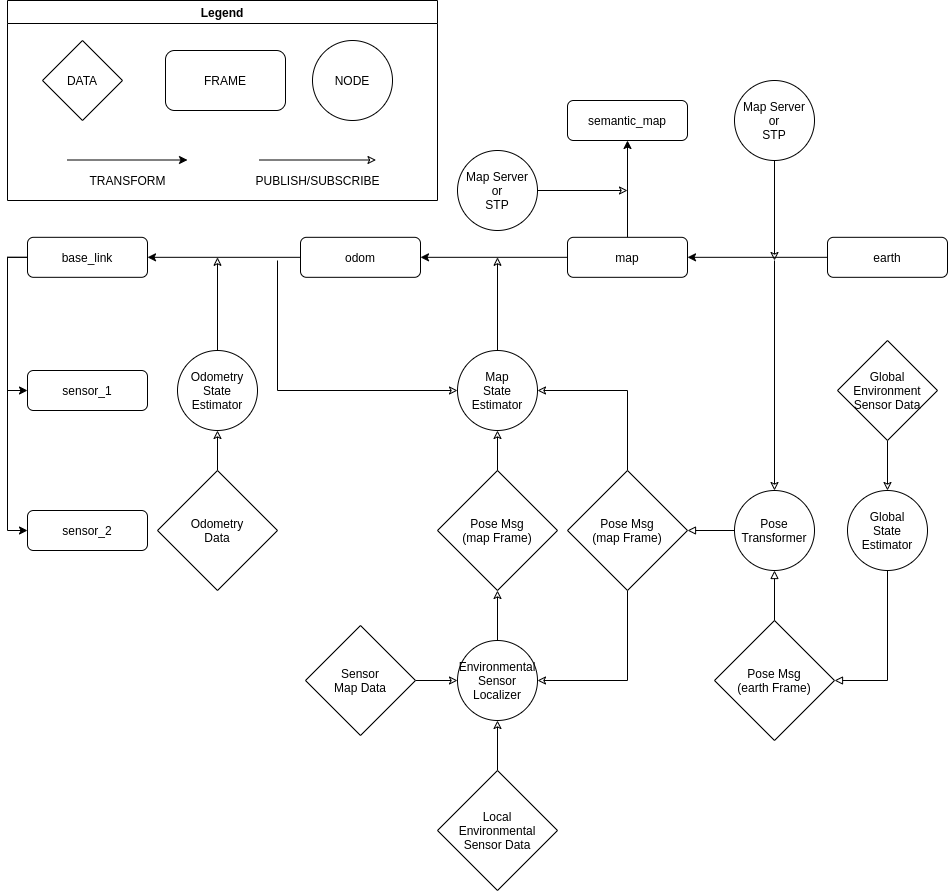

AVP 2020 Demo Localization Design {#avp-localization-design}
============================================================

# Overview

In accordance with REP-105[1] and guided by the design principals laid out in #localization-design, the following localization architecture will be used for the AVP 2020 Demo and will form the basis for future improvements for the Autoware.Auto localization architecture.

---

[TOC]

# Frames

The following frames are defined:
- `/earth`
- `/map`
- `/semantic_map`
- `/odom`
- `/base_link`
- Additional coordinate frames should be attached to the `/base_link` frame to represent sensor frames
- Optional coordinate frames may be attached to the `/base_link` frame for ease of sensor calibration

REP-105[1] provides enough specificity with regard to most frames for a concrete implementation with the exception of the `/base_link` frame. For the purposes of this demo, the location of the `/base_link` frame shall be defined as:

- A location which is rigidly attached to the vehicle frame coincident with the center of the rear axle of the vehicle, as measured under the following conditions:
  - The vehicle is free of any additional load aside from the equipment and components provided by the vehicle manufacturer upon delivery
  - The tire pressure meets the manufacturer specifications in all four tires
  - The vehicle is placed on flat, level ground

# Assumptions

The following assumptions are made for the provided localization architecture:
- A static, globally-fixed sensor data map is available for localization (sensor map)
- A static, globally-fixed semantic data map is available for traffic rules and some stationary objects (semantic map)
- Locally-referenced odometry sensor data are available from one or more sources
- Locally-referenced environmental sensor data are available from one or more sources
- Globally-referenced position data are available from one or more sources

# Components

The final localization stack for the AVP 2020 Demo should have the following components:
- Global Sensor Localizer
  - Input: Globally-referneced sensor data (e.g. GPS)
  - Output: `sensor_msgs/PoseWithCovarianceStamped` in `/earth` frame
- Environmental Sensor Localizer
  - Example: NDT Matching
  - Input: Locally-referenced sensor data with a fixed, external localization environment (e.g. lidar, radar)
  - Input: Globally-referenced sensor data map (e.g. point cloud)
  - Input: `/earth`->`/map` transform
  - Input: `sensor_msgs/PoseWithCovarianceStamped` in `/earth` frame (from Global Sensor Localizer)
  - Output: `nav_msgs/Odometry` in `/map` frame
- Odometry Localizer
  - Input: Locally-referenced sensor data with no fixed, external localization environment (e.g. wheel encoders, visual odometry, accelerometer, gyroscope)
  - Output: `/odom`->`/base_link` transform
  - Output: `nav_msgs/Odometry` in `/odom` frame
- Map Localizer
  - Input: `nav_msgs/Odometry` in `/odom` frame (from Odometry Localizer)
  - Input: `nav_msgs/Odometry` in `/map` frame (from Environmental Sensor Localizer)
  - Input: `/earth`->`/map` transform
  - Input: `sensor_msgs/PoseWithCovarianceStamped` in `/earth` frame
  - Output: `/map`->`/odom` transform

# Transforms

The final localization stack for the AVP 2020 Demo should have the following transforms available:
- `/base_link`->`<sensor_frame>`: Static. Published by `tf2::static_transform_publisher` or `robot_description` when using a URDF file.
  - **Explanation**: It is assumed that all sensors which are attached to the body of the mobile robot are done so rigidly and are not free to move. Being as `/base_link` is a frame that is defined as being tied to a fixed point on the mobile robot's body, any transform between a sensor and `/base_link` would be static.
- `/odom`->`/base_link`: Dynamic. Published by Odometry Localizer.
  - **Explanation**: While localization to the local map provides a globally-fixed location estimate, no sensor or algorithm to localize to the local map can be considered infallible and can not be trusted to always provide a continuous, error-free position. In addition, an Environmental Sensor Localizer can not be expected to provide an accurate localization estimate when an initial position in the local map has not yet been computed. Since navigation is based on the full `/map`->`/base_link` transform, this estimate can be used for navigation even when a globally-relative or map-relative position is not yet available.
- `/map`->`/odom`: Dynamic. Published by Map Localizer.
  - **Explanation**: The Map Localizer takes the position estimate provided by the Environmental Sensor Localizer (a `/map`->`/base_link` relation) as well as the position estimate provided by the Global Sensor Localizer (an `/earth`->`/base_link` relation which is translated to a `/map`->`/base_link` relation using a lookup of the fixed `/earth`->`/map` transform) and fuses them into a single `/map`->`/base_link` estimate. It then relates this estimate to the origin of the odom frame as a `/map`->`/odom` transform, which it publishes. This allows integration of both the odometry localization data and environmental sensor localization data into a transform tree of `/map`->`/odom`->`/base_link` which should be considered a single transform (i.e. ephemeral `/map`->`/base_link`) by navigation and planning components.
- `/map`->`/semantic_map`: Static. Published by `tf2::static_transform_publisher` or Map Loader
  - **Explanation**: Since there often exists an offset between the origin of the Semantic Map and the origin of the Sensor Map, different frames for each map are necessary. Also, since localization is usually more time-sensitive than functions which utilize the Semantic Map, the typical `/map` frame is tied to the Sensor Map which avoids a transform lookup in localization but necessitates one in functions that use the Semantic Map such as path planning. Making this transform required rather than optional avoids an unnecessary dependency between the sensor and semantic maps. Additionally, ommitting this transform would necessitate an assumption that both the semantic map and the sensor map have coincident origins which would require either another unnecessary interdependence or run-time verification of this assumption, which causes an order-of-operations dependency.
- `/earth`->`/map`: If a map server is used, dynamic but non-contiguous and published by the map server. If no map server is used, static and published by `tf2::static_transform_publisher`
  - **Explanation**: Since the Sensor Map (published in the `/map` frame) is defined as being globally-fixed, this transform relates the origin of the Sensor Map to the origin of the `/earth` frame which is referenced as ECEF. The publication of this transform is necessary for the Environmental Sensor Localizer to create an initial position estimate using the output from the Global Sensor Localizer. This transform is also necessary for the Map Localizer to be able to utilize the output from the Global Sensor Localizer as a fusion input.

# Diagram

The following diagram depicts this architecture:

# References

- [1] [REP105 - Coordinate Frames for Mobile Platforms](https://www.ros.org/reps/rep-0105.html)
